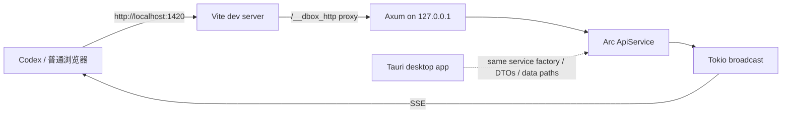

# 本地 Dev HTTP 桥实施计划

> 文档状态：Implemented
> 更新日期：2026-08-28
> 适用范围：仅本地开发与 Codex 浏览器调试

## 1. 目标

为 dbox 增加一个独立的 debug-only Rust HTTP 后端，使运行在普通浏览器中的 Vue 前端能够调用真实 Rust 业务层，并接收与 Tauri WebView 同契约的后端事件。该后端不启动或依赖 Tauri 应用窗口。

完成后使用以下命令启动完整开发环境：

```bash
npm run dev:http
```

该命令通过 Node 编排脚本同时启动现有 Vite dev server 和启用了 `dev-http` feature 的独立 Rust binary，不经过 Tauri CLI。

预期开发流程：

1. 执行 `npm run dev:http`，只启动 Vite 和无窗口 Rust Dev HTTP 服务。
2. 在 Codex 内置浏览器中打开 `http://localhost:1420`。
3. 浏览器前端通过 Vite proxy 调用监听在 `127.0.0.1` 的 Rust HTTP 服务。
4. Headless 后端与 Tauri 应用复用同一个 `ApiService::production` 工厂、DTO 和桌面数据目录规则。

## 2. 明确约束

- Dev HTTP 只监听 IPv4 回环地址 `127.0.0.1`，不监听 `0.0.0.0` 或局域网地址。
- HTTP transport 暴露当前 Tauri transport 的全部 command，不区分只读和写入模式。
- 不增加登录、令牌、额外鉴权、命令白名单或写操作开关。
- 不把 Dev HTTP 用作生产接口、远程接口或跨设备调试接口。
- Rust HTTP 服务只在 debug 构建且显式启用 `dev-http` feature 时存在。
- 普通 `npm run tauri dev` 和 release 构建不得启动或链接 Dev HTTP 启动路径。
- `dev-http` feature 用于 release 构建时必须通过 `compile_error!` 失败。
- 开发时 Node 编排进程必须保持运行；Ctrl-C 同时停止 Vite 和 Rust HTTP 服务。

## 3. 总体架构



HTTP 层不得重新实现 Provider、计划生成、命令执行、持久化或错误映射。它只负责：

- 把 JSON 请求反序列化为现有 API DTO；
- 调用共享的 `ApiService`；
- 把返回值序列化为与前端 `unwrapCommand` 兼容的响应；
- 把现有 `ApiEvent` 转换为 Server-Sent Events。

## 4. 启动与编译控制

### 4.1 Cargo feature

在 `src-tauri/Cargo.toml` 增加：

- `dev-http` feature；
- 由该 feature 启用的可选 HTTP/SSE 依赖；
- Axum 作为 HTTP router/server；
- 必要时使用 `tower-http`、`tokio-stream` 或等价的最小依赖实现代理兼容和 SSE stream。

Rust 模块和启动调用统一使用：

```rust
#[cfg(all(debug_assertions, feature = "dev-http"))]
```

`dev-http` 依赖全部为 optional，默认 feature 为空。正常 release 构建不包含 HTTP 依赖或启动分支；显式把 `dev-http` 用于 release 会触发 `compile_error!`，防止误打包。

### 4.2 npm 命令

`package.json` 使用：

```json
"dev:http": "node scripts/dev-http.mjs"
```

命令职责：

- Node 编排器启动 `npm run dev`；
- Node 编排器通过 Cargo 运行 required-feature 的 `dev-http` binary；
- 任一子进程失败或收到退出信号时，另一个子进程同步退出；
- Vite 继续固定使用 `1420` 端口；
- Rust Dev HTTP 默认使用固定回环端口，建议为 `1430`。

## 5. HTTP 契约

### 5.1 路由

建议使用以下前缀，避免与 Vue Router 页面路由冲突：

```text
GET  /__dbox_http/health
POST /__dbox_http/commands/snapshot
POST /__dbox_http/commands/refresh
POST /__dbox_http/commands/preview
POST /__dbox_http/commands/confirm
POST /__dbox_http/commands/cancel
POST /__dbox_http/commands/run_history
POST /__dbox_http/commands/run_log
POST /__dbox_http/commands/settings
POST /__dbox_http/commands/save_settings
POST /__dbox_http/commands/validate_manifest
POST /__dbox_http/commands/read_manifest
POST /__dbox_http/commands/save_manifest
GET  /__dbox_http/events
```

每个 command handler 应保持强类型，不使用一套接受任意命令名和任意 `serde_json::Value` 的动态分发器。无参数 command 接受空 JSON 对象或无请求体；有参数 command 直接接受现有 request DTO。

### 5.2 Command 响应

成功响应保持现有前端约定：

```json
{
  "status": "ok",
  "data": {}
}
```

业务错误保持：

```json
{
  "status": "error",
  "error": {
    "code": "invalid_request",
    "message": "...",
    "retryable": false,
    "details": {}
  }
}
```

业务错误由现有 `ApiErrorDto` 表达，不在 HTTP 层建立第二套错误模型。请求体无法解析、路由不存在等纯 HTTP 错误可以使用对应的 4xx 状态码。

### 5.3 事件

`GET /__dbox_http/events` 使用 SSE，并沿用当前 Tauri event name：

- `refresh-progress`
- `run-state`
- `run-output`
- `tool-state`

SSE `data` 保存现有 DTO 的 JSON 结构。浏览器 transport 负责把它适配为当前 Store 已使用的 `{ payload }` callback 形状。

Headless 后端使用 Tokio broadcast 把同一个 `ApiEvent` 发送给所有已连接的 SSE 客户端。Tauri transport 继续使用原有 `TauriApiEventEmitter`，两种 transport 不在同一进程中运行。慢速或断开的浏览器客户端不能阻塞命令执行；广播缓冲区溢出时允许客户端重新获取 snapshot 恢复状态。

## 6. Rust 实施步骤

### 6.1 提取共享服务工厂

提取 `ApiService::production`，让 Tauri `ApiState` 与 headless Dev HTTP binary 复用相同的业务构造过程：

- 保留现有 Tauri command 签名和 `tauri-specta` 导出；
- headless binary 按 Tauri 相同规则解析 config、data 和 log 目录；
- HTTP handler 直接调用 `ApiService`，不构造 `tauri::State`，也不调用 command wrapper。

### 6.2 新增 Dev HTTP 模块

建议新增 `src-tauri/src/api/dev_http.rs`，并由 `api/mod.rs` 在 feature 开启时导出。模块职责包括：

- 创建 Axum router；
- 注册全部 command 路由；
- 监听 `127.0.0.1:1430`；
- 提供 health endpoint；
- 管理 SSE subscriber；
- 在独立 Tokio runtime 中运行，随 Node 编排器退出而结束。

端口被占用时，应在终端输出清楚的启动错误，并让 `npm run dev:http` 失败或立即暴露不可用状态，不能静默退回随机端口。

### 6.3 扩展事件 emitter

保留 `ApiEventEmitter` trait，新增广播 emitter：

- Dev HTTP emitter 把 `ApiEvent` 写入 Tokio broadcast channel；
- 没有 SSE 订阅者时视为正常空闲状态；
- 现有 `MemoryApiEventEmitter` 测试行为保持不变。

## 7. 前端实施步骤

### 7.1 HTTP transport

建议新增 `src/api/httpTransport.ts`，实现现有 `ApiTransport`：

- command 方法通过 `fetch` 调用 `/__dbox_http/commands/*`；
- 返回值严格满足现有 `commands` 的类型形状；
- SSE channel 实现 `listen` 并返回取消监听函数；
- 不复制 `bindings.ts` 中的 DTO，所有类型继续从生成文件导入。

`src/api/transport.ts` 在应用启动时选择 transport：

- Tauri WebView 使用当前 generated bindings；
- 普通浏览器开发环境使用 HTTP transport；
- Vitest 继续使用现有 `setTransportForTests`，测试 seam 不变。

### 7.2 Vite proxy

在 `vite.config.ts` 的 dev server 中增加 `/__dbox_http` proxy，目标为：

```text
http://127.0.0.1:1430
```

浏览器始终向 `http://localhost:1420/__dbox_http/*` 发请求，不直接拼接 Rust 端口。生产构建不包含 Vite dev proxy，因此不会改变 Tauri release 行为。

### 7.3 开发状态提示

现有“后端已连接”状态继续由 snapshot 是否成功加载决定。health endpoint 主要用于启动探测和诊断，不建立新的全局连接状态模型。

## 8. 测试计划

### 8.1 Rust

- Router 测试覆盖所有 command 的请求反序列化和响应 envelope。
- 使用现有 fixture service 或测试 `ApiService` 验证 HTTP 与直接 service 调用返回一致。
- 使用现有 API snapshot fixture 锁定 camelCase、枚举值和十进制字符串字段。
- SSE 测试至少覆盖事件名、payload 和断开订阅者。
- 验证服务实际绑定地址为 `127.0.0.1`。
- 验证未启用 `dev-http` feature 时没有 HTTP 启动路径。

### 8.2 前端

- HTTP command 成功、业务错误、无效 JSON 和网络失败。
- transport 自动选择：Tauri 环境选择 generated transport，浏览器环境选择 HTTP transport。
- SSE `listen`、取消监听和事件 payload 适配。
- Store 在 HTTP transport 下完成 snapshot 初始化、刷新、运行记录和设置读写。

### 8.3 手工验收

1. 执行 `npm run dev:http`。
2. 确认进程列表只有 Vite、Node 编排器和 `dev-http` binary，没有 Tauri 主程序或窗口。
3. 在 Codex 浏览器打开 `http://localhost:1420`。
4. 确认工具、运行记录和设置来自真实 Rust 后端。
5. 在浏览器触发 refresh、preview、confirm、cancel、设置保存和 manifest 保存。
6. 确认浏览器能持续收到刷新、运行输出和状态事件。
7. Ctrl-C 后确认 Vite 与 Dev HTTP 都退出且没有遗留进程。
8. 执行普通 Tauri dev 和 release 构建，并验证 release + `dev-http` feature 被编译期拒绝。

## 9. 推荐实施顺序

1. 增加 Cargo feature、可选依赖和 debug-only 模块骨架。
2. 提取共享 `ApiService::production` 工厂，启动独立 headless Axum server。
3. 实现全部 command 路由及统一响应 envelope。
4. 实现 broadcast emitter 和 SSE endpoint。
5. 实现前端 HTTP transport 与自动选择。
6. 配置 Vite proxy。
7. 补齐 Rust、前端和手工 smoke tests。
8. 使用 Codex 浏览器完成一次页面检查和元素定位验收。

## 10. 完成标准

- `npm run dev:http` 一条命令只启动 Vite 和 Dev HTTP，不创建 Tauri 窗口。
- Codex 浏览器访问 `http://localhost:1420` 后可使用全部现有后端功能。
- Tauri WebView 的 command/event 行为没有回归。
- HTTP 与 Tauri 共用 `ApiService` 构造逻辑、DTO、数据目录和错误模型，不存在第二份业务实现。
- 浏览器可接收四类现有实时事件。
- 服务只监听 `127.0.0.1`。
- 未显式启用 `dev-http` 时不启动任何 HTTP listener。
- release 构建无法启用 `dev-http` feature。
- 前端、Rust、契约与 release 验证全部通过。
