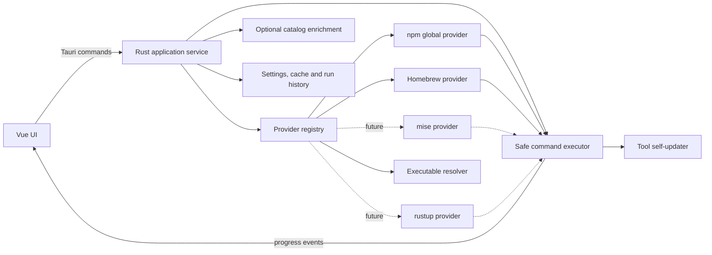

# dbox 开发计划

> 文档状态：Draft  
> 更新日期：2026-08-27  
> 目标平台：macOS 优先，架构上保留 Linux 扩展能力

## 1. 产品定位

dbox 是一个通用的本地命令行工具管理器，用来统一发现、查看和更新通过 Homebrew、npm 全局安装，或由工具自身安装器管理的 CLI。Agent TUI 是首要使用场景，但不是产品边界；普通命令行工具也应以同样方式被发现和管理。

对于 npm global 和 Homebrew，dbox 默认扫描并展示管理器返回的**全部全局安装项**，不依赖预置工具白名单。一个未收录在 dbox catalog 中的 npm package 或 brew formula/cask，也会自动获得由其安装来源提供的版本检查和更新能力。catalog 只用于补充图标、类别、可执行文件映射、自更新命令、插件/扩展等特殊能力。

dbox 不假设“一个工具只有一种更新方式”。它将工具拆成若干可独立更新的组件，每个组件可以配置一个或多个更新策略。例如 Pi 可以拆为：

- `core`：使用 `pi update --self` 更新，或切换为 `npm install --global <package>@latest`；
- `extensions`：使用 `pi update --extensions` 更新；
- 需要一次性全部更新时，可额外配置 `pi update --all`，但不把它作为两个组件的默认更新方式，避免重复执行。

截至本文更新日期，Pi 官方文档所列命令正是 `pi update --self`、`pi update --extensions` 和 `pi update --all`。实现时仍应把这些命令放在可升级的工具清单中，而不是散落硬编码在业务逻辑里。参考：[Pi Packages 官方文档](https://github.com/earendil-works/pi/blob/main/packages/coding-agent/docs/packages.md#install-and-manage)。

## 2. 当前仓库状态

当前项目是 Tauri 2 + Vue 3 + TypeScript 的基础脚手架：

- 前端只有模板欢迎页；
- Rust 后端只有示例 `greet` command；
- 尚无工具发现、配置、命令执行、状态持久化和测试；
- 产品名、bundle identifier、Rust crate 名仍是 `tauri-test`；
- Tauri CSP 当前未启用。

因此第一阶段需要先完成项目重命名和基础工程约束，再开始产品功能。

## 3. 目标与非目标

### 3.1 MVP 目标

1. 自动发现全部 Homebrew formula/cask、npm global package，并关联它们暴露在 `PATH` 中的一个或多个 CLI。
2. 展示安装项的来源、包标识、可执行文件、当前版本、最新版本和更新状态。
3. 支持“一个工具、多个组件、每个组件多个更新策略”的配置模型。
4. 支持单个组件、单个工具和选中工具的批量更新。
5. 执行前展示准确命令并要求确认；执行中流式展示日志；执行后重新检测版本。
6. 未配置 manifest 的 npm/brew 安装项也能使用 provider 的通用更新策略；允许用户新增或覆盖工具清单来增强特殊行为。
7. 对失败、超时、取消、工具不在 `PATH`、网络不可用等情况给出可操作的错误信息。
8. 保存最近执行记录，但不收集或上传任何遥测数据。
9. 用可注册的 Provider 接口隔离 npm/brew 细节，为 mise、rustup、Cargo 安装项和直接安装工具保留扩展能力。

### 3.2 MVP 非目标

- 不负责管理 API key、Agent 会话或模型配置；
- 不提供任意软件商店，不在首版实现搜索并安装未知软件；
- 不在首版实现卸载和降级；
- 不在首版实现无人值守自动更新；
- 不承诺处理需要 `sudo`、密码输入或复杂交互提示的更新流程；
- 不猜测所有安装项是不是 Agent；无法识别的条目以普通 CLI/Package 展示，但仍可通过 npm/brew 管理；
- 不管理项目内依赖、语言库或 npm local package，只管理全局/用户级工具；
- 不在 MVP 支持 Windows。

## 4. 核心概念

| 概念 | 含义 | 示例 |
| --- | --- | --- |
| Provider | 某类安装来源的发现、检查和更新实现 | npm global、Homebrew、未来的 mise/rustup |
| Installation | Provider 扫描到的源级安装记录 | `npm-global:@scope/pkg`、`brew-formula:jq` |
| Tool | UI 中的管理实体；默认由一个 Installation 自动生成，也可被 catalog 增强 | jq、Pi、Deno、Flutter |
| Executable | 一个 Installation 暴露的一个或多个命令 | npm package 同时提供 `foo`、`foo-lsp` |
| Component | 可独立更新的部分 | `core`、`extensions` |
| Strategy | 某个 Component 的一种更新方法 | 自更新、npm global、brew upgrade |
| Discovery Rule | 判断 Tool 是否已安装并定位它的规则 | executable、npm package、brew formula |
| Version Source | 获取当前或最新版本的方法 | 命令输出、npm registry、brew metadata |
| Run | 一次检查或更新任务及其日志 | queued → running → succeeded |

必须保持以下边界：

- **Provider 扫描是基础，catalog 是可选增强。** npm/brew 返回的任何全局安装项都能生成通用 Tool，不能因为没有内置 manifest 就丢弃。
- **安装记录以来源限定身份。** ID 至少包含 Provider 与包坐标，避免同名 npm package、brew formula 和可执行文件互相覆盖。
- **发现方式不等于更新方式。** 即使 dbox 通过 `PATH` 发现 `pi`，它也可能由 npm、安装脚本或其他版本管理器安装。
- **检查版本不等于执行更新。** 某些扩展只有更新命令，没有可靠的远端版本接口，此时 UI 应显示“可执行更新/上次更新结果”，不能伪造“已是最新”。
- **Tool 状态由 Component 状态汇总。** 任一组件可更新时 Tool 为“有更新”；任一组件检测失败时显示部分未知，而不是把整个 Tool 误报为最新。
- **同一产品的多来源安装不自动合并。** MVP 分别展示并标注路径，避免误删或更新错误来源；后续可提供用户确认后的关联视图。

## 5. 总体架构



### 5.1 前端职责

- 工具列表、筛选、状态汇总和空状态；
- 工具详情、组件列表和更新策略选择；
- 更新预览与确认；
- 执行队列、实时日志、取消和历史记录；
- 设置页、环境诊断、工具清单校验和打开配置目录；
- 只通过类型化 Tauri command 调用后端，不直接拼接或执行 shell 命令。

### 5.2 Rust 后端职责

- 注册 Provider，并通过 Provider 发现全部全局安装项、版本和可执行文件；
- 为普通安装项生成通用 Tool，再加载、校验和合并可选的内置/用户增强清单；
- 解析当前版本、查询最新版本并比较版本；
- 生成不可变的更新预览，确认后执行同一份计划；
- 管理队列、互斥、超时、取消、日志脱敏和结果持久化；
- 向前端发送结构化进度事件；
- 严格限制 Tauri 暴露面，前端不能调用任意进程执行接口。

### 5.3 推荐目录结构

```text
src/
  api/                 # 由 Rust API DTO 生成的 command/event bindings 与薄封装
  components/          # 通用 UI 组件
  views/               # Tools、Runs、Settings
  stores/              # 工具状态、运行队列、设置
  types/               # 前端专有类型；Rust API DTO 类型不手工镜像
src-tauri/src/
  commands/            # Tauri command 薄适配层
  domain/              # Provider、Installation、Tool、Component、Run
  providers/           # provider registry、npm、brew，未来 mise/rustup
  catalog/             # 可选 manifest 增强、覆盖与迁移
  discovery/           # PATH 与 executable 映射
  version/             # 版本解析与比较
  executor/            # Tokio/process-wrap 等开源库的薄适配
  persistence/         # settings、cache、history
  environment/         # GUI 环境/PATH 解析与诊断
  agents/              # 后续 Agent 路径和能力适配
  skills/              # 后续原生 Skill 内容、来源和部署管理
  mcp/                 # 后续 MCP 配置管理与应用格式适配
src-tauri/resources/catalog/
  pi.toml              # 特殊能力示例，不是工具白名单
tests/fixtures/bin/    # 集成测试使用的假命令
```

## 6. 工具配置设计

### 6.1 文件分层

采用“Provider 自动发现 + 可选版本化 TOML 增强清单”：

1. Provider 扫描结果：运行时生成，不要求每个 npm/brew 包都有静态文件；
2. `src-tauri/resources/catalog/*.toml`：随应用发布的只读增强清单，只收录需要特殊能力或展示信息的工具；
3. `<app_config_dir>/tools.d/*.toml`：用户新增的直接安装工具，或对自动发现/内置条目的覆盖；
4. `<app_config_dir>/settings.toml`：Provider 开关、默认策略、扫描、环境和并发设置；
5. `<app_data_dir>/state.json`：检测缓存、上次成功版本和运行摘要，使用 `atomic-write-file` 承担同目录临时文件、同步和原子替换；
6. `<app_log_dir>/runs/*.jsonl`：逐次运行的结构化日志，按数量和总大小轮转。

所有目录通过 Tauri path API 获取，业务代码不硬编码 macOS 绝对路径。采用本地文件持久化，新增 Skill/MCP 元数据分别直接保存为 skills.json、mcp.json。按个人本地使用规模设计，不规划 SQLite 等数据库或大型查询系统。

### 6.2 通用安装项自动建模

Provider 的扫描结果直接合成可管理 Tool，无需 manifest：

- npm global 返回 `@scope/foo@1.2.3` 时，生成稳定 ID `npm-global:@scope/foo`、默认 `core` 组件，以及由 npm Provider 生成的检查/更新计划；如果 package 暴露多个 `bin`，全部挂到同一 Installation；
- Homebrew 返回 formula `jq` 时，生成 ID `homebrew-formula:jq` 和 Homebrew Provider 策略；cask 使用独立 namespace；
- catalog 或用户清单通过包坐标、Provider ID、可执行文件名等 matcher 命中安装项后，只增加/覆盖显示信息、额外 Component 和 Strategy；
- Provider 生成的命令同样必须经过 UpdatePlan 预览，不因为是内置 Provider 就绕过确认和日志记录。

这意味着 dbox 的基础覆盖范围随 npm/brew 已安装列表自然增长，catalog 规模不会成为支持新 CLI 的瓶颈。

### 6.3 Manifest 增强示例：Pi

Pi 只是“通用 npm 安装项被特殊能力增强”的示例，不是 dbox 的特定目标。以下配置用于确定增强能力，不代表必须锁死具体 npm 包名。Pi 发行包名发生变化时，只需升级 matcher/内置清单或由用户覆盖 `installations`。

```toml
schema_version = 1
id = "pi"
display_name = "Pi"
categories = ["agent", "tui"]
homepage = "https://pi.dev"

[[discovery]]
kind = "executable"
names = ["pi"]

[[installations]]
id = "npm"
kind = "npm_global"
package = "@earendil-works/pi-coding-agent"

[[components]]
id = "core"
display_name = "Core"
default_strategy = "self"

[components.installed_version]
kind = "command"
program = "pi"
args = ["--version"]
stream = "stdout"
parser = { kind = "semver_regex", pattern = "([0-9]+\\.[0-9]+\\.[0-9]+)" }

[components.latest_version]
kind = "npm_registry"
installation = "npm"

[[components.update_strategies]]
id = "self"
display_name = "Pi self update"
kind = "command"
program = "pi"
args = ["update", "--self"]
timeout_seconds = 600

[[components.update_strategies]]
id = "npm-global"
display_name = "npm global"
kind = "package_manager"
manager = "npm"
args = [
  "install",
  "--global",
  "--ignore-scripts",
  "@earendil-works/pi-coding-agent@latest",
]
timeout_seconds = 600

[[components]]
id = "extensions"
display_name = "Extensions"
default_strategy = "pi-extensions"
version_tracking = "unsupported"

[[components.update_strategies]]
id = "pi-extensions"
display_name = "Pi extensions update"
kind = "command"
program = "pi"
args = ["update", "--extensions"]
timeout_seconds = 900
```

### 6.4 配置规则

- `schema_version` 必填；不支持的未来版本必须拒绝加载并给出文件位置和原因。
- `id` 在合并后唯一；用户同 `id` 清单以字段级覆盖内置清单，数组按子项 `id` 合并，避免复制整份内置定义。
- Provider、包名、scope 和 package kind 共同决定通用安装项身份；展示名称和 executable 名不能单独作为唯一键。
- manifest 是增强/覆盖层，不是 npm/brew 工具白名单；删除 manifest 不应让底层安装项从扫描结果中消失。
- 命令必须以 `program` + `args[]` 保存，默认禁止 shell 字符串。
- MVP 不支持 `sh -c`、管道、重定向和命令替换。将来若提供 `shell` 策略，必须显式标为高风险并逐次确认。
- 每个策略可配置 `cwd`、额外环境变量、超时、成功退出码和更新后的验证动作。
- 环境变量只允许声明名称和值；日志中对名称匹配 `TOKEN`、`KEY`、`SECRET`、`PASSWORD` 的值脱敏。
- 自定义策略首次执行或清单发生变化后必须重新确认。
- 内置策略可以提供推荐默认值，但用户可以按组件切换并持久化选择。
- `version_tracking = "unsupported"` 表示该组件不能可靠判断是否有更新，UI 不显示错误的红点或“最新版本”。

## 7. 发现与版本检查

### 7.1 环境发现

macOS 图形应用通常拿不到交互式终端中的完整 `PATH`，而 npm 又可能由 nvm、fnm、mise 或 asdf 管理。这是 MVP 的关键技术风险，必须在业务功能之前解决。

环境基础设施不自行实现：启动时优先使用 Tauri 官方 [`fix-path-env-rs`](https://github.com/tauri-apps/fix-path-env-rs) 修复 GUI PATH，并使用 [`which`](https://docs.rs/which/latest/which/) 定位 executable。dbox 只保留用户覆盖、缓存、Provider 报告路径和诊断信息的编排。

环境解析顺序建议如下：

1. 用户在设置中指定的可执行文件绝对路径；
2. dbox 上次验证成功的绝对路径；
3. `fix-path-env-rs` 修复后的应用 `PATH`，由 `which` 返回一个或多个候选；
4. Provider 自身通过公开 CLI 报告的路径，例如已定位的 `brew --prefix`。

dbox 不解析 `.zshrc`/`.bashrc`，不自行实现 `which` 或跨平台目录规则。解析到 `npm`、`brew`、`pi` 等程序后，后端使用绝对路径和独立参数执行。设置页应展示“终端可见但 dbox 不可见”、多路径冲突和库调用失败的诊断结果，并允许用户刷新或覆盖路径。

### 7.2 Provider 接口

包管理器能力通过注册表而不是散落的 `match provider { ... }` 分支接入。领域层使用字符串 `ProviderId` 和能力声明，不让 npm/brew 成为封闭枚举。建议的 Rust 接口形态：

```rust
#[async_trait]
trait ToolProvider {
    fn id(&self) -> ProviderId;
    fn capabilities(&self) -> ProviderCapabilities;
    async fn probe(&self, env: &ResolvedEnvironment) -> ProviderStatus;
    async fn scan(&self, ctx: &ScanContext) -> Result<Vec<Installation>>;
    async fn check_updates(&self, items: &[Installation]) -> Vec<UpdateStatus>;
    async fn plan_update(&self, request: ProviderUpdateRequest) -> Result<CommandPlan>;
}
```

`ProviderCapabilities` 至少声明：是否支持全量扫描、远端版本检查、更新、版本固定、多版本共存、列举 executable 和层级 Component。UI 根据能力展示操作，不能假设每个 Provider 都等价于 npm。

MVP 提供四种 adapter/provider：

- `executable`：定位程序并运行版本命令；
- `npm_global`：读取**全部**全局包、包版本、prefix 和 package `bin` 映射；
- `homebrew_formula` / `homebrew_cask`：读取**全部**已安装项、outdated 元数据和可执行文件关联；
- `custom_command`：只用于无法由前三者覆盖的版本检查。

所有外部输出先解析为中间 DTO，再进入领域模型。解析器必须容忍额外日志、ANSI 控制码、非零但含有效 JSON 的输出，并在失败时保留经过脱敏的原始摘要。

后续 Provider 复用同一接口：

- `mise`：工具及其多版本、当前激活版本、全局 scope；
- `rustup`：toolchain、component、target 和 self-update，属于层级型 Provider，不能简化成普通单包；
- `cargo_install`：通过 Cargo 安装的用户级 binary crate；
- `direct`：Deno、Bun、Flutter 等由官方脚本、压缩包或自更新命令直接安装的实例；
- 其他 SDK/版本管理器：只需实现自身能力，不修改 Tool、UpdatePlan 和队列主流程。

Deno、Bun、Flutter 可能同时来自 brew、mise 或直接安装。dbox 应忠实展示实际 Installation 与路径，更新计划由该 Installation 的 Provider 生成，不能按产品名猜测更新命令。

### 7.3 状态模型

组件状态至少包括：

- `not_installed`
- `checking`
- `up_to_date`
- `update_available`
- `unknown`
- `check_failed`
- `updating`
- `update_succeeded`
- `update_failed`
- `cancelled`

版本比较优先使用语义化版本；非 SemVer 版本保留原值并由 adapter 提供比较规则。无法可靠比较时返回 `unknown`，不使用字符串字典序猜测。

## 8. 安全执行与任务队列

### 8.1 更新预览

点击更新后，后端先生成 `UpdatePlan`，内容包括：

- Tool、Component、Strategy；
- 已解析的程序绝对路径和参数数组；
- 工作目录、环境变量名称、超时；
- 当前版本、期望版本或“未知”；
- 风险提示和是否可能联网；
- `plan_hash` 和过期时间。

前端确认时只回传 `plan_id`/`plan_hash`，后端执行原计划；若配置、程序路径或版本快照已变化，则计划失效并要求重新预览，防止“看到的命令”和“执行的命令”不一致。

CommandPlan 只是一层 dbox 领域 DTO。序列化、UUID、hash、secret 和展示转义分别使用 `serde`、`uuid`、`blake3`、`secrecy` 及维护中的 quoting crate，不自研通用命令 DSL 或安全基础设施。

### 8.2 执行约束

- 同一 Tool 同时只能有一个更新任务；
- 默认全局并发数为 1，MVP 暂不并发操作包管理器，避免 brew/npm 锁和相互覆盖；
- 批量更新按工具排队，一个任务失败不阻断其他工具，但最终显示部分成功；
- 使用 `tokio` 负责异步进程、stdout/stderr 和 timeout/select；
- 使用 `process-wrap` 的 Tokio/process-group/kill-on-drop 能力管理进程组，不手写 PID 树、signal 或平台 unsafe 代码；
- 使用 `tokio-util::CancellationToken` 传递取消，并通过 `process-wrap` 清理进程组；
- 使用 `tracing` 生态及成熟 ANSI/字节 crate 实现结构化日志、有界缓冲和容错；
- dbox 只给库输出增加 RunId、事件序号和业务状态映射；
- 更新成功的判断条件是退出码成功且 post-check 通过；退出码成功但版本验证失败显示“命令成功，验证未知/失败”；
- 不自动输入密码，不缓存 sudo 凭据；检测到权限或交互提示时终止并给出终端操作建议。

## 9. UI 信息架构

### 9.1 工具页

- 顶部：刷新、仅看可更新、来源/类别筛选、批量更新；
- 卡片或表格：名称、来源、当前版本、最新版本、组件汇总、状态；
- 工具详情：安装路径、安装来源、各组件状态、策略下拉、最后检查/更新时间；
- 未纳管候选：扫描到的 npm/brew 包，可选择隐藏或创建自定义工具定义。

### 9.2 更新确认页/弹窗

- 按 Component 展示将执行的命令；
- 明确区分 `core` 与 `extensions`；
- 展示策略选择和风险提示；
- 支持从批量计划中取消某一项；
- 默认不提供“以后都不确认任意自定义命令”的危险选项。

### 9.3 运行页

- 队列、运行中、成功、失败、取消状态；
- 实时 stdout/stderr、耗时和取消按钮；
- 失败摘要置顶，完整日志可展开；
- 可复制脱敏日志、重新检查或重试同一策略。

### 9.4 设置页

- 环境/PATH 诊断；
- brew/npm 可执行文件路径；
- 刷新频率、命令超时、日志保留；
- 工具清单列表、校验错误和打开配置目录；
- 每个组件的默认更新策略。

## 10. Tauri API 草案

Tauri command 保持粗粒度、类型化，避免暴露 `run_command(program, args)` 之类的万能接口：

```text
get_app_snapshot() -> AppSnapshot
refresh_tools(tool_ids?, force_remote?) -> RefreshJob
preview_updates(UpdateSelection) -> UpdatePlan
confirm_update(plan_id, plan_hash) -> RunId
cancel_run(run_id) -> CancelResult
get_run(run_id) -> RunDetail
list_runs(cursor?, limit?) -> RunPage
get_settings() -> Settings
update_settings(SettingsPatch) -> Settings
list_manifests() -> ManifestSummary[]
validate_manifest(contents) -> ValidationResult
save_user_manifest(expected_revision, contents) -> ManifestSummary
open_config_directory() -> ()
```

事件：

```text
dbox://refresh-progress
dbox://run-state-changed
dbox://run-output
dbox://tool-state-changed
```

写配置使用 revision/etag 做乐观锁，防止外部编辑配置时被 UI 静默覆盖。

## 11. 分阶段实施

具体工作已拆分为独立文件，执行、依赖和验收以 [任务索引](tasks/README.md) 为准。开发顺序采用 Rust 后端优先：T01–T16 全部通过后，才开始 T17–T19 的正式图形界面。

### Phase 0：工程基线（0.5–1 天）

- [ ] 将产品名、窗口标题、bundle identifier、npm package 和 Rust crate 从 `tauri-test` 重命名为 dbox；
- [ ] 清理模板页面和示例 `greet` command；
- [ ] 确定代码格式化、lint、单元测试和 CI 命令；
- [ ] 恢复合理 CSP，只保留必要 Tauri capability；
- [ ] 建立错误类型、日志规范和前后端共享 DTO 约定。

**完成标准：** 应用以 dbox 身份启动，前后端构建和空测试流水线通过，不再包含模板功能。

### Phase 1：领域模型、配置与执行内核（2–3 天）

- [ ] 实现 Provider/Installation/Tool/Component/Strategy/Run 领域类型；
- [ ] 实现 ToolProvider trait、Provider Registry 和 capability 模型；
- [ ] 实现 TOML schema、校验、内置清单与用户覆盖合并；
- [x] 集成原子写入库，实现应用目录、schema、revision 和 retention policy；
- [ ] 集成 Tokio/process-wrap/CancellationToken/tracing 等开源库，完成命令执行薄适配；
- [ ] 实现 UpdatePlan 预览与 hash 校验；
- [ ] 使用 fixture 假命令覆盖成功、失败、超时和取消。

**完成标准：** 不依赖 UI，可用 fake Provider 合成任意普通 CLI 安装项，也可加载 Pi 增强清单、生成计划、执行假更新并得到完整 Run 结果。

### Phase 2：环境、发现与版本检查（2–3 天）

- [ ] 实现 GUI 环境/PATH 诊断和绝对路径解析；
- [ ] 实现 executable、npm global、brew formula/cask adapter；
- [ ] 将 npm/brew 返回的全部安装项合成通用 Tool，并关联一个或多个 executable；
- [ ] 实现 SemVer 解析、未知版本和状态汇总；
- [ ] 实现检测缓存、手动刷新和刷新去重；
- [ ] 加入少量增强清单，至少用 Pi 验证多 Component，用两个未知名称 fixture 验证无需清单的 npm/brew 通用管理。

**完成标准：** 在真实 macOS 环境可列出全部 npm global 与 Homebrew 安装项，而不仅是 catalog 样例；无 brew/npm、离线和解析失败时均返回结构化错误而不崩溃。

### Phase 3：Rust 应用服务、队列与接口门禁（3–4 天）

- [ ] 完成 refresh → preview → confirm → execute → post-check 的纯 Rust 应用服务；
- [ ] 完成串行批量队列、部分失败、取消、重试和中断恢复；
- [ ] 完成运行历史、日志轮转和配置 revision 冲突处理；
- [ ] 完成粗粒度 Tauri commands、DTO 与事件契约，使用 `tauri-specta` 从公开 API DTO 生成 TypeScript bindings，但不制作正式 Vue 页面；
- [ ] 使用 FakeProvider/fake binaries 覆盖 npm、brew、Pi 增强和异常流程；
- [ ] 通过 T16 定义的 Rust 后端集成、许可证和 RustSec 验收门。

**完成标准：** 不打开图形界面也能用自动化测试验证全部基本业务；20 个模拟任务不会死锁，失败不阻断后续队列；fmt、Clippy、Rust tests 全部通过。未达到此标准不得开始正式 UI。

### Phase 4：图形界面对接（3–4 天）

- [x] 使用 Vue Router、Pinia、Vitest/Vue Test Utils 和 T15 生成的 bindings 完成前端壳层；
- [x] 完成工具列表、详情、刷新、筛选和 Provider 诊断；
- [x] 完成组件级策略选择、更新预览与确认；
- [x] 完成实时日志、运行历史、取消、重试和批量结果；
- [x] 使用 `@tanstack/vue-virtual` 处理持续日志/大列表，VueUse 处理通用节流，`axe-core` 做基础可访问性回归；
- [x] 完成设置、manifest 校验与 revision 冲突交互；
- [x] 前端只消费后端 DTO/UpdatePlan，不复制版本比较、命令生成或队列业务逻辑。

**完成标准：** 在已经通过 T16 的后端之上完成 UI 对接；用户能检查和更新任意 npm/brew 全局安装项；Pi 仅用于证明多组件增强模型。

### Phase 5：打包与 MVP 验收（1–2 天）

- [ ] 完成 macOS Apple Silicon/Intel 构建验证；
- [ ] 使用 Tauri CLI/bundler/updater 与官方签名、公证、CI 链路，检查图标和权限说明；
- [ ] 完成新用户空状态、无包管理器和 PATH 异常走查；
- [ ] 编写用户配置、故障排查和添加工具清单文档；
- [ ] 固化回归测试清单并产出首个 MVP 包。

**完成标准：** 全新用户可以从安装到完成第一次检查；常见失败有明确恢复路径；不要求用户从终端启动 dbox 才能识别工具。

### 工期估算

单人专注开发约 **13–20 个工作日**，其中 Rust 后端与自动化门禁预计 9–13 天，图形界面和发布预计 4–7 天。若同时设计完整视觉系统、做签名公证或在 MVP 加入 mise/rustup，需要额外预留时间。

## 12. 测试计划

### 12.1 Rust 单元测试

- manifest schema、字段级合并、版本迁移和错误定位；
- Provider 注册、capability 分支、来源限定 ID 和通用 Tool 合成；
- 命令参数保持数组，不经过 shell 展开；
- SemVer、前缀版本、无法比较版本；
- 状态汇总和 UpdatePlan 失效；
- 脱敏、日志截断、轮转；
- Run 状态机不允许非法跳转。

### 12.2 Rust 集成测试

通过临时目录和 fixture fake binaries 模拟：

- `brew`/`npm`/`pi` 的空列表、单项、批量和异常输出；
- 未知 npm/brew 安装项、同名跨 Provider 安装项、一个 package 暴露多个 executable；
- 命令成功、非零退出、超时、取消、输出乱码和超长日志；
- 路径中包含空格；
- 配置被外部修改；
- 批量任务部分失败；
- 更新后版本变化、未变化和验证失败。

测试不得调用真实 `brew upgrade` 或 `npm install -g`。

### 12.3 前端测试

- Pinia store、生成 bindings 适配和 DTO 映射单测；
- 工具列表各状态、部分未知和空状态；
- 策略切换、预览确认和过期计划；
- 虚拟化实时日志和 VueUse 节流，确保高频事件不丢最终状态；
- `axe-core` 基础可访问性回归；
- 批量部分失败、取消与重试交互。

### 12.4 手工验收矩阵

| 场景 | 预期 |
| --- | --- |
| 未安装 brew/npm | 显示未配置，不阻断其他 adapter |
| npm 由 nvm/fnm/mise/asdf 管理 | 可通过环境诊断找到或手动指定 |
| 未被 catalog 收录的 npm/brew 包 | 自动出现并可使用来源 Provider 检查/更新 |
| 同一产品由 brew 和 mise/direct 重复安装 | 分开展示来源与路径，不猜测合并 |
| Pi core 选择 self | 预览并执行 `pi update --self` |
| Pi core 选择 npm | 预览并执行配置中的 npm global 策略 |
| Pi extensions | 只执行 `pi update --extensions` |
| 扩展版本不可检测 | 显示未知/可手动更新，不误报“已最新” |
| 用户取消 | 任务进入 cancelled，子进程被清理 |
| 更新命令成功但版本未变 | 显示验证未知或失败，不误报成功升级 |
| 批量任务部分失败 | 后续继续执行，最终清楚汇总 |

## 13. 风险与应对

| 风险 | 应对 |
| --- | --- |
| GUI 与终端 PATH 不一致 | `fix-path-env-rs`、`which`、绝对路径缓存、用户覆盖和诊断 |
| 包管理器输出和更新语义变化 | Provider 集中适配并配 fixture 回归；特殊工具用版本化 catalog/override |
| 同一 CLI 有多个发行包或安装来源 | Installation 独立建模，发现后让用户确认来源 |
| 安装项数量多、列表噪声大 | 默认全部纳管，同时提供 Provider/类别/有更新筛选和用户隐藏状态 |
| 自更新与包管理器更新混用 | 每个 Component 保存明确默认 Strategy，预览展示来源 |
| 扩展无法获知远端版本 | 支持 `version_tracking = unsupported`，只记录执行结果 |
| 包管理器锁或更新互相干扰 | MVP 全局串行，后续按 manager 建互斥组 |
| 任意自定义命令带来代码执行风险 | 不使用 shell、展示解析后命令、配置变更后重新确认 |
| 任务输出包含凭据 | 环境值和常见 secret 模式脱敏，复制日志使用脱敏版本 |
| 命令等待交互输入 | stdin 默认关闭；识别提示后失败并给出手动处理建议 |
| 应用在更新中退出 | 持久化 Run；下次启动将未结束任务标为 interrupted 并重新检查 |

## 14. MVP 验收标准

MVP 只有同时满足以下条件才算完成：

1. dbox 能在不从终端启动的情况下发现**全部** npm global 与 Homebrew formula/cask 安装项。
2. 未收录在 catalog 的 npm/brew 安装项自动拥有通用 Tool、版本状态和 Provider 更新计划。
3. package 的多个 executable 能关联到同一个 Installation；跨 Provider 同名项不会碰撞或被错误合并。
4. 工具特殊能力可以只通过用户 TOML 新增或覆盖。
5. Pi 作为增强示例被建模为至少 `core`、`extensions` 两个组件。
6. Pi core 可以在 self 与 npm global 两种策略之间切换，extensions 可以独立更新。
7. 每次更新前都展示最终解析的程序、参数、来源和组件，不执行未确认的变化计划。
8. 更新支持日志、超时、取消、失败恢复和 post-check。
9. 版本不可检测时显示 unknown/unsupported，不误报 up-to-date。
10. 批量任务部分失败不会阻断剩余任务，结果可追溯。
11. 单元/集成测试不修改开发机上的真实全局包。
12. 前端不能绕过 Provider/manifest 和 UpdatePlan 执行任意命令。
13. 配置和运行日志均只保存在本机，敏感信息经过脱敏。

## 15. Skill 与 MCP 管理集成

完整调研、能力对照和分阶段计划见 [Skill 与 MCP 管理接入计划](skills-mcp-integration-plan.md)。2026-09-10 根据用户要求重新比较 `reference-only/skills` 与 `reference-only/cc-switch`，本节替代原先的 `npx skills` 唯一后端方案；已完成用户级原生管理实现，使用和已知边界见 [管理说明](skills-mcp-management.md)，实现决策见 [ADR 0004](adr/0004-native-extensions.md)。

### 15.1 选型与范围

采用参考 cc-switch 的 Rust 原生 Skill 管理：统一技能库、应用分发、已有安装导入、独立更新检查、备份恢复。MCP 采用独立服务及各应用配置适配器。首个完整版本支持 Claude Code、Codex、Gemini CLI 的用户级管理，项目级和更多 Agent 按后续阶段扩展。

CLI 已支持基础安装/移除、多 Agent、JSON 列表、指定 Skill 更新和远程归档，不能把这些列为缺失能力。但保留技能库的全部停用、独立检查、安装接管与备份恢复仍需额外管理逻辑。本地 `reference-only/skills`（版本字段 `1.5.25`）中，`check` 与 `update` 分支调用同一更新函数，不能沿用原先的只读检查假设。逐项源码依据见接入计划第 2 节。

### 15.2 实现边界

- Skill/MCP 元数据分别用 skills.json、mcp.json 保存，整体读取、内存筛选、原子写回；不使用 SQLite 等数据库、ORM 或搜索索引。
- Skill 内容和来源保存在 dbox 私有数据目录；Agent 目录是受管理的部署目标，全部停用不删除技能库。
- 已有 Skill 先只读扫描并导入快照，显式接管后才允许修改原部署；来源未知时不猜测远程更新地址。
- 不与 CLI、cc-switch 同时写同一份管理状态；外部 lock 只可通过独立的兼容导入器读取，不写回。
- MCP 导入不反向写应用配置；修改按应用格式生成 diff，只变更计划中的服务器并保留无关字段。
- 文件操作和外部命令都经后端计划确认；使用指纹检测外部修改，普通文件备份、manifest.json 与现有 Run 历史处理部分失败和中断，不建设额外事务或版本存储系统。
- 下载、解压、配置编辑等基础设施优先使用成熟库，避免手写解析器或引入整套 cc-switch 框架。

### 15.3 接入顺序

1. Agent 路径/capability、Skill/MCP 模型及持久化。
2. 扩展计划、Run 和执行分派，保留原工具更新行为。
3. Skill 本地导入、接管、启停、卸载与备份恢复。
4. Skill 来源发现、安装、独立检查与更新。
5. MCP 读取、导入、转换、预览与写入。
6. 两类 Vue 管理界面、Tauri/HTTP 契约、集成验收。

细分任务与验收依赖以接入计划 P0–P7 为准。现有 T21/T22 调整为原生 Skill 后端和界面，不再实施 CLI 薄适配。

## 16. MVP 之后的候选能力

按优先级评估，不提前塞入首版：

1. 定时检查和系统通知，但仍默认人工确认更新；
2. 工具安装、卸载、版本固定和回滚；
3. 按第 15 节接入原生 Skill 管理与 MCP 配置管理；
4. mise、rustup、cargo_install 和 direct Provider；
5. catalog 在线签名更新和社区工具清单；
6. Linux 支持；
7. 按 Provider 互斥组并行的智能队列；
8. 导入/导出机器配置，帮助迁移开发环境；
9. 使用 Tauri updater 更新 dbox 自身；
10. 对扩展/插件提供更细的列表、版本和固定能力。

## 17. 独立开发任务

任务已经拆分到 [`docs/tasks/`](tasks/README.md)，每个任务一个文件：

- T01–T16：Rust 基础、领域、执行器、Provider、应用服务、队列、Tauri API 和后端验收门；
- T17–T20：后端门禁通过后的图形界面与发布；
- T21–T22：参考 cc-switch 的原生 Skill 管理后端与界面；
- T23–T26：mise、rustup、Cargo Install 和 Direct Provider；
- Skill/MCP 共享基础及 MCP 后端、界面和集成验收：见 [接入计划 P0–P7](skills-mcp-integration-plan.md#9-分阶段任务与验收)。

每个 Rust 任务必须在同一任务中完成相应单元/fixture/集成测试。T16 未标记 Completed 前，T17–T19 保持 Blocked。
